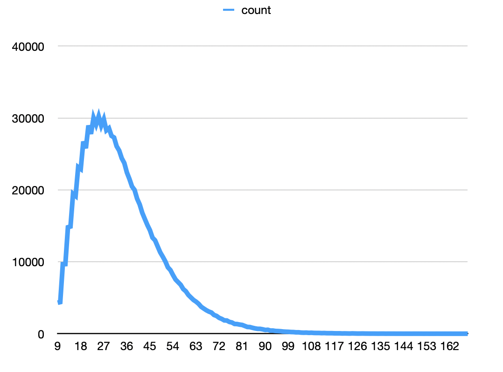

# Pretty Pretty Princess SIM

Simulates games of pretty pretty princess to determine the average length of a game

## How To Run

```sh
npm install
npm run start
```

## Findings

Simulating 1,000,000 games...

|Player Count|Average|Median|Min|Max|Avg Rounds|
|:--|:--|:--|:--|:--|:--|
|2|34|31|9|187|16.84|
|3|45|42|13|213|14.65|
|4|56|53|17|286|13.62|

## Charts

### 2 Player Game



Pretty much as expected, the game is normally very short, but there is a long tail in which it is possible to have *very* long games
